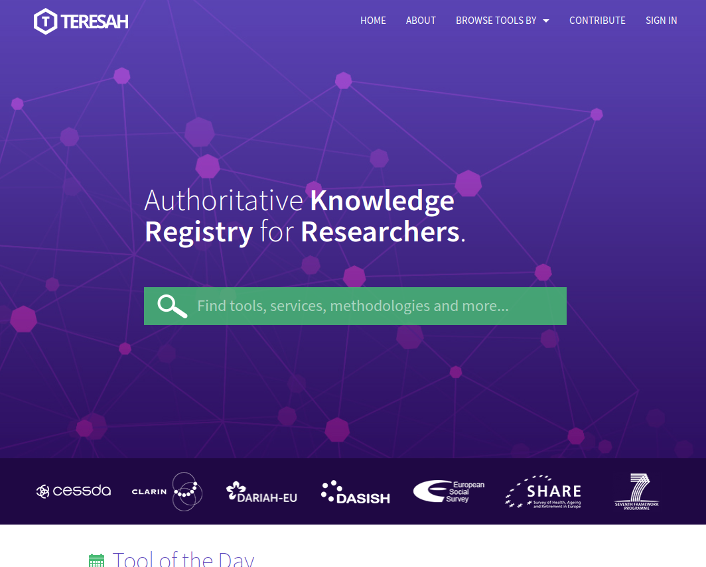
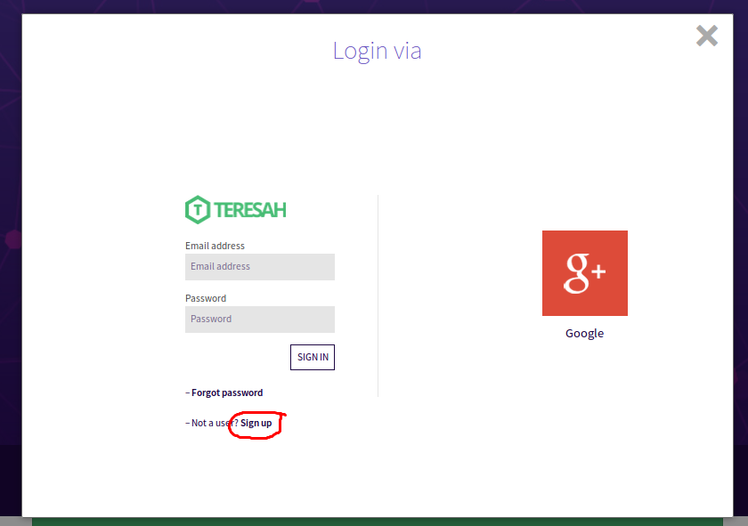
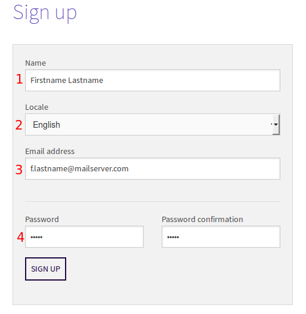
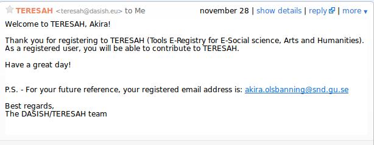
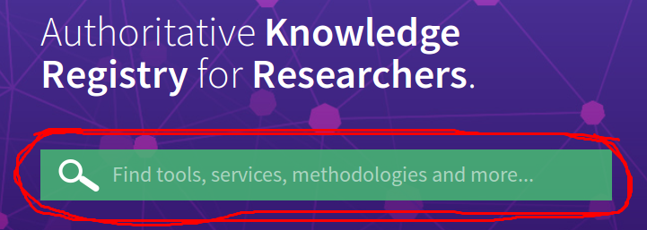
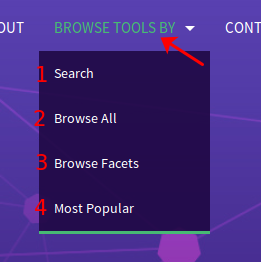
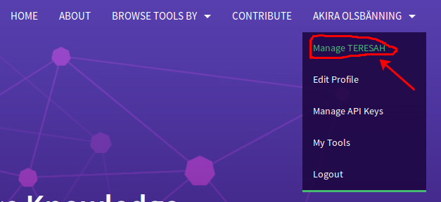
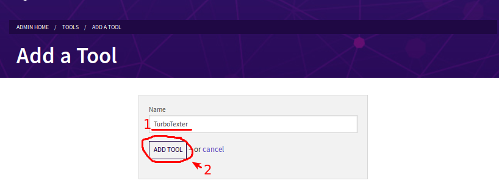

---
author:
- Akira Olsbänning
date: '2014-12-08'
title: Manual for TERESAH
...

Introduction to TERESAH
=======================

Welcome to TERESAH. TERESAH (standing for *Tools E-Registry for E-Social science, Arts and Humanities*) is a web based application for the collection and organisation of data research tools. It was created using funds from the Seventh Framework Programme.

*The TERESAH front page*

The license of this document
----------------------------

This manual (like the contents of TERESAH itself) is licensed under the [Creative Commons CC-BY-SA 4.0 license.](http://creativecommons.org/licenses/by-sa/4.0/)

Signing up and logging in
=========================

Creating an account for TERESAH
-------------------------------

Before starting to use TERESAH, you need an account. It is also possible to log in using so-called federated login providers such as linked-in, but for now, lets create a dedicated account.

On the front page, click on "sign in" in the upper right corner. 

*The top bar (no user currently logged in)*

Next you will be taken to the login page. Since we are assuming that you don't have an account yet, click on "Sign up" below the "Password" field.

*The sign in form. The link to sign up for a new account is highlighted.*

*The sign up form for creating a new user account*

Now we need some basic information about you: 

- 1) Your name
- 2) Your prefered locale (currently English and Swedish are available)
- 3) A mail adress 
- 4) The password you want to use. Repeat the password. 

Once you have filled out the fields correctly, click on "Sign Up".

*The mail sent to new users.*

Once your application has been processed, you will get a confirmation mail to the address you used in the previous step.

Viewing tools
=============

Finding and looking at a tool
-----------------------------

Lets look around the tools already in the TERESAH listings

*The TERESAH front page search box*

*The top bar tool browsing menu.*

- 1) Search for a tool by its name
- 2) Browse the complete TERESAH listings in alphabetical order
- 3) Browse through the different facet listings
- 4) See a listing of the most popular tools

*The search page*

- 1) The number of tools on the current page and the total amount of tools matching your currently selected search filters (3)
- 2) General search box.
- 3) Facet search filters. By selecting one or more of these facets, only tools matching those specific facets are shown
- 4) Alphabetical listing of all tools matching your selected search filters from (3)
- 5) Page switcher, showing how many full pages are needed to show the listings in (4).

*Browsing the alphabetical listing of all tools*

- 1) The number of tools, on the current page and the total amount of tools matching your currently selected letter.
- 2) Alphabetical selection. Click on a letter to show only tools beginning with that initial.
- 3) Tools listing
- 4) Page selector

*Browsing tools by Facet*

Here you can browse tools by their facet.

- 1) Developer - who created the tool?
- 2) Keyword - the free-form keywords associated with the tool
- 3) License - under what license is the tool released? (eg. Creative Commons, GPL, Properitary...)
- 4) Platform - what system does the tool require to run? (eg. Windows, Linux, the web...)
- 5) Standards - which technical standards does the tool support? (eg. XML, JSON, HTTP...)
- 6) Tool type - just what kind of tool is this? (eg. text, graphics, audio...)

*Viewing a specific tool*

- ​1) The name of the tool. As you can see, each tool has one or more initials inside the cicle to the left. Tools with a name made up from more than one word has more letters in the circle.
- 2) Data sources. In this screenshot, TERESAH's own source is selected. You can also get data from dirtdirectory.org, and more sources may be added in the future.
- 3) Data about this tool, from the source choosen above.
- 4) Information about the currently selected data source.
- ​5) Data export. Here you can get the data for the tool in the format of your choice.
- 6) Similar tools. Tools similar to the current one that you also might find interesting/relevant.

Exporting tool RDF info
-----------------------

When viewing a tool in TERESAH, you can export information about it in RDF format. Depending of what you want to use the RDF for, you can export it in different languages.

- RDF/JSONLD - A JSON dialect for exchange of links
- RDF/TURTLE - Terse RDF Triple Language
- RDF/XML - Plain XML (using the RDF namespace)

Just click on the format you want, and your browser should either show it in a separate page or let you download and save it in a file.

Adding or removing tools
========================

Entering and leaving admin mode
-------------------------------

In order to actually add or remove a tool, you need to enter "Admin Mode". To do this, you need to have a user type of *Collaborator*, *Supervisor* or *Administrator*. See the [reference section on user types](#types of users) for more info. 

First, go to the administrative section of TERESAH. Choose "Manage TERESAH" from the user menu.

*Going to the administrative section of TERESAH from the user menu*

*The TERESAH administrative section tool listing*

As the banner across the top of the page now says, *please do be careful*. Use your administrative powers responsibly.

In order to leave admin mode and go back to just browsing TERESAH, click on "Browse TERESAH" in the user menu. You will be back in non-admin broser mode, and the banner across the top of the screen will go away.

*Going back to browsing mode in the user menu*

Adding a new tool
-----------------

So far we have only looked at tools put into TERESAH by other people, or taken from external data sources. Now we will create one ourselves.

First, go to the administrative section as described above.

*The TERESAH administrative section tool listing*

Click on "Add new tool"

*The button "Add new tool"*

You will see the "Add new tool" dialog.

*The dialog for adding a new tool*

Removing an existing tool
-------------------------

Removing an existing tool is, quite understandably, even easier than adding a new one.

The TERESAH API
===============

Since this manual is aimed at non-programmers, we will not cover the TERESAH API here. For up-to-date information regarding the API, se the folder TERESAH/documentation/api/v1/ in the git repository.

Reference
=========

Special terms and assorted acronyms
-----------------------------------

TERESAH uses some specific terminology and technical words that you may or may not be familiar with. Here we will attempt to clarify things.

TERESAH
:   *Tools E-Registry for E-Social science, Arts and Humanities*

API
:   *Application Programming Interface* - a defined way for programs to "speak" to each other.

API-key
:   A "password" or authentication that allows you to use the TERESAH API.

Facette
:   A *facette* is a category that is used to sort different tools. Facettes include (for example) the developer of the tool, or the platform it runs on.

Tool
:   In TERESAH, a *tool* refers to a specific piece of software (and its page in TERESAH) that might be useful to researchers.

RDF
:   *Resource Description Framework*

XML
:   *eXtensible Markup Language*

TURTLE
:   *Terse RDF Triple Language* a language/format designed for describing RDF triples. See [Wikipedia article here](https://en.wikipedia.org/wiki/Turtle_%28syntax%29)

JSONLD
:   *JSON for Linking Data*

JSON
:   *JavaScript Object Notation*

DiRT
:   *Digital Research Tools*. See also "dirtdirectory.org"

dirtdirecory.org
:   One of the external data sources used in TERESAH

Federated Login
:   Logging in to a web page (or other net service) using a third party, such as Google or Facebook

Types of users
--------------

Different users have different rights in TERESAH. These are the types of user, and what rights they have.

Authenticated user
:   User with registered account. Can edit own profile and create lists of tools. This is the "basic" type of user - all the other types of user "builds" on this type.

Collaborator
:   Authenticated user with collaborator status. Can add and edit tools and data types

Supervisor
:   Authenticated user with supervisor status. Can add, edit and remove tools, data types, data sources, list activities, and harvest other data sources.

Administrator
:   Authenticated user with administrator status. Has full access to all administrative functions.
