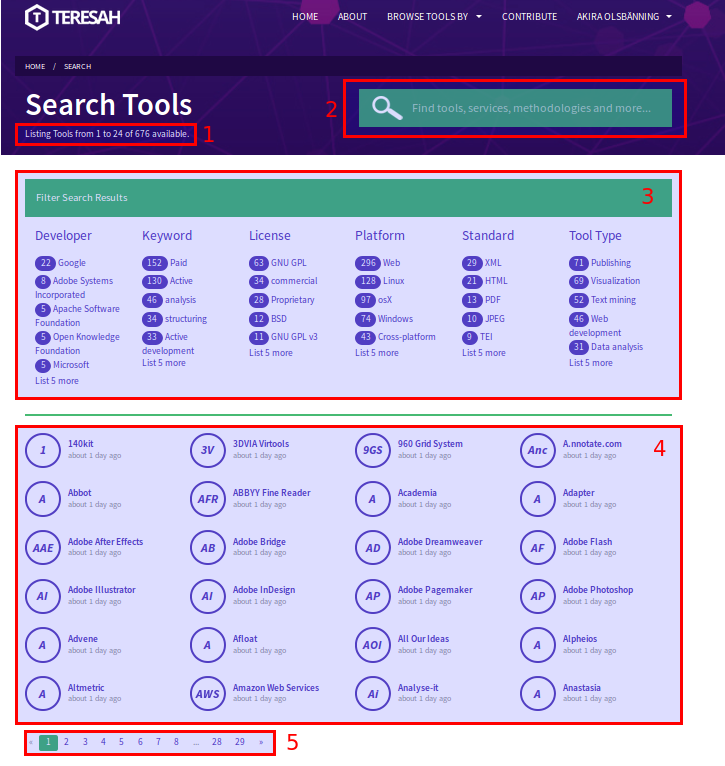
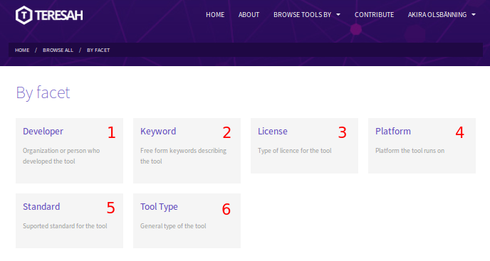
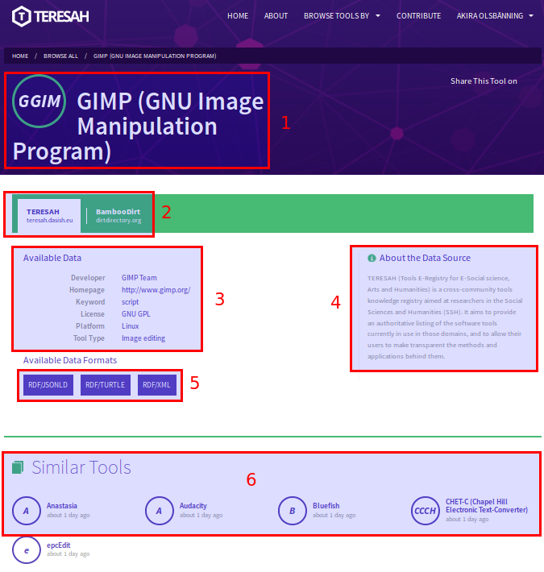

---
author:
- Akira Olsbänning
date: '2014-12-08'
title: Manual for TERESAH
...

Introduction to TERESAH
=======================

Welcome to TERESAH. TERESAH (standing for *Tools E-Registry for E-Social
science, Arts and Humanities*) is a web based application for the
collection and organisation of data research tools. It was created using
funds from the Seventh Framework Programme.

*The TERESAH front page*

The license of this document
----------------------------

This manual (like the contents of TERESAH itself) is licensed under the
[Creative Commons CC-BY-SA 4.0
license.](http://creativecommons.org/licenses/by-sa/4.0/)

Signing up and logging in
=========================

Creating an account for TERESAH
-------------------------------

Before starting to use TERESAH, you need an account. It is also possible
to log in using so-called federated login providers such as linked-in,
but for now, lets create a dedicated account.

On the front page, click on "sign in" in the upper right corner. *The
top bar (no user currently logged in)*

Next you will be taken to the login page. Since we are assuming that you
don't have an account yet, click on "Sign up" below the "Password"
field.

*The sign in form. The link to sign up for a new account is
highlighted.*

Now we need some basic information about you: (1) Your name, (2) Your
prefered locale (currently English and Swedish are available), (3) A
mail adress (4) The password you want to use. Repeat the password. Once
you have filled out the fields correctly, click on "Sign Up".

*The sign up form for creating a new user account*

*The mail sent to new users.*

Once your application has been processed, you will get a confirmation
mail to the address you used in the previous step.

Viewing tools
=============

Finding and looking at a tool
-----------------------------

Lets look around the tools already in the TERESAH listings

​1) Search for a tool by its name 2) Browse for a tool in the

-   ​1) The name of the tool. As you can see, each tool has one or more
    initials inside the cicle to the left. Tools with a name made up
    from more than one word has more letters in the circle.

-   ​2) Data sources. In this screenshot, TERESAH's own source is
    selected. You can also get data from dirtdirectory.org, and more
    sources may be added in the future.

-   ​3) Data about this tool, from the source choosen above.

-   ​4) Information about the currently selected data source.

-   ​5) Data export. Here you can get the data for the tool in the
    format of your choice.

-   ​6) Similar tools. Tools similar to the current one that you also
    might find interesting/relevant.

Exporting tool RDF info
-----------------------

When viewing a tool in TERESAH, you can export information about it in
RDF format. Depending of what you want to use the RDF for, you can
export it in different languages.

-   RDF/JSONLD - A JSON dialect for exchange of links

-   RDF/TURTLE - Terse RDF Triple Language

-   RDF/XML - Plain XML

Just click on the format you want, and your browser should either show
it in a separate page or let you download and save it in a file.

Adding or removing tools
========================

Adding a new tool
-----------------

So far we have only looked at tools put into TERESAH by other people, or
taken from external data sources. Now we will create one ourselves.

Important note: in order to actually add a tool, you need to have a user
type of Collaborator, Supervisor or Administrator. See the [reference
section on user types](#user_types) for more info

Removing an existing tool
-------------------------

Removing an existing tool is, quite understandably, even easier than
adding a new one.

The TERESAH API
===============

Since the TERESAH API is still under implementation, this manual is not
currently covering it. For up-to-date information regarding the API, se
the folder TERESAH/documentation/api/v1/ in the git repository.

Reference
=========

Special terms and assorted acronyms
-----------------------------------

TERESAH uses some specific terminology and technical words that you may
or may not be familiar with. Here we will attempt to clarify things.

TERESAH
:   *Tools E-Registry for E-Social science, Arts and Humanities*

API
:   *Application Programming Interface* - a defined way for programs to
    "speak" to each other.

API-key
:   -

Facette
:   A *facette* is a category that is used to sort different tools.
    Facets include (for example) the developer of the tool, or the
    platform it runs on.

Tool
:   In TERESAH, a *tool* refers to a specific piece of software (and its
    page in TERESAH) that might be useful to researchers.

RDF
:   *Resource Description Framework*

XML
:   *eXtensible Markup Language*

TURTLE
:   *Terse RDF Triple Language* a language/format designed for
    describing RDF triples. See [(Wikipedia article
    here](https://en.wikipedia.org/wiki/Turtle_%28syntax%29)

JSONLD
:   *JSON for Linking Data*

JSON
:   *JavaScript Object Notation*

DiRT
:   *Digital Research Tools*

dirtdirecory.org
:   -

Types of users
--------------

Different users have different rights in TERESAH. These are the types of
user, and what rights they have.

Authenticated user
:   User with registered account. Can edit own profile and create lists
    of tools. The "basic" type of user - all the other types of user
    "builds" on this type.

Collaborator
:   Authenticated user with collaborator status. Can add and edit tools
    and data types

Supervisor
:   Authenticated user with supervisor status. Can add, edit and remove
    tools, data types, data sources, list activities, and harvest other
    data sources.

Administrator
:   Authenticated user with administrator status. Has full access to all
    administrative functions.
